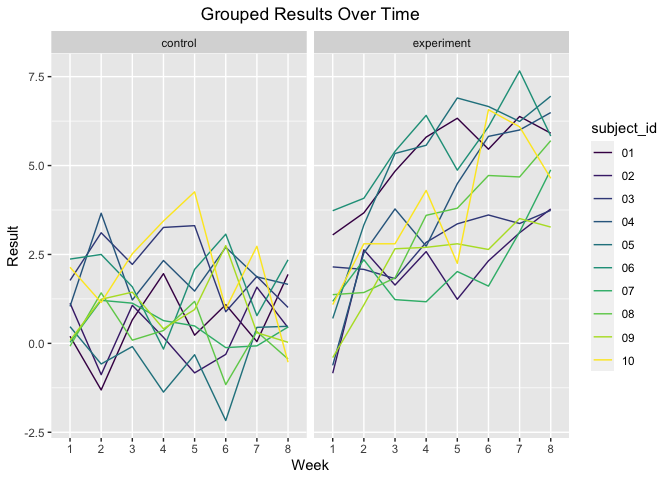

Untitled
================

## Problem 1

``` r
files = list.files("./data", pattern = ".csv", all.files = FALSE, 
full.names = FALSE)

long = data.frame(participants = files) %>% 
  mutate(contents = map(participants, ~read.csv(file.path("./data", .)))) %>% 
  separate(participants, into = c("control", "subject_id")) %>% 
  unnest(contents) %>% 
  mutate(control = recode(control, `con` = "control", `exp` = "experiment")) 
```

    ## Warning: Expected 2 pieces. Additional pieces discarded in 20 rows [1, 2, 3, 4,
    ## 5, 6, 7, 8, 9, 10, 11, 12, 13, 14, 15, 16, 17, 18, 19, 20].

``` r
spaghetti = long %>% pivot_longer(week_1:week_8,
                                  names_to = "week",
                                  names_prefix = "week_",
                                  values_to = "result") %>% 
  ggplot(aes(x = week, y = result, group = subject_id, color = subject_id)) + 
  geom_path() + 
  facet_grid(~control) + 
  labs(title = "Grouped Results Over Time",
       x = "Week",
       y = "Result") + 
  theme(plot.title = element_text(hjust = 0.5)) +
  viridis::scale_color_viridis(discrete = TRUE)

spaghetti
```

<!-- -->
